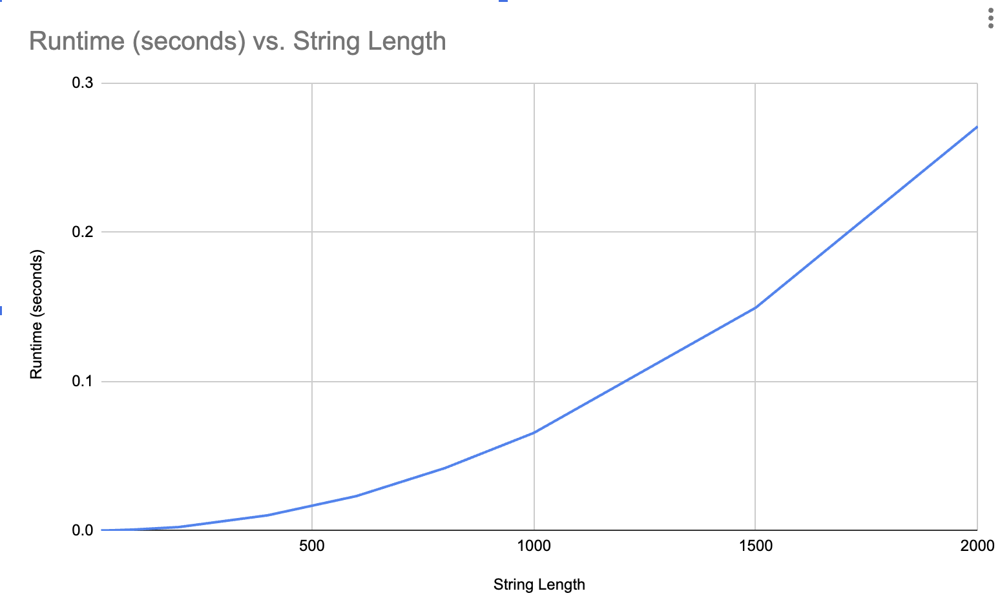

# Highest Value Longest Common Subsequence - Programming Assignment 3

- **Name:** Carlos Felipe
- **UFID:** 70583368

## Description
Given two strings A and B and an alphabet where each character has a value, this program finds the common subsequence that maximizes total character value using dynamic programming.

## How to Run

### Run the solver
```
python3 src/hvlcs.py <input_file>
```

Example:
```
python3 src/hvlcs.py tests/example.in
```

### Generate test files
```
python3 src/generate_tests.py
```
This creates 10 test files in `data/` with string lengths ranging from 25 to 2000.


## Project Structure
```
├── README.md
├── src/
│   ├── hvlcs.py               # Main solver
│   ├── generate_tests.py      # Test file generator
│   └── benchmark.py           # Runtime benchmarking and graphing
├── data/                      # Generated test input files
└── tests/
    ├── example.in             # Worked example from assignment
    └── example.out            # Expected output for example
```

## Input Format
```
K
x1 v1
x2 v2
...
xK vK
A
B
```
- K is the number of characters in the alphabet
- Each of the next K lines contains a character and its integer value
- A is the first string
- B is the second string

## Output Format
```
<max_value>
<optimal_subsequence>
```

## Question 1: Empirical Comparison


The graph shows that runtime grows quadratically as string length increases,
which is consistent with the O(m * n) time complexity of the DP algorithm.

## Question 2: Recurrence Equation


## Question 3: Big-Oh
